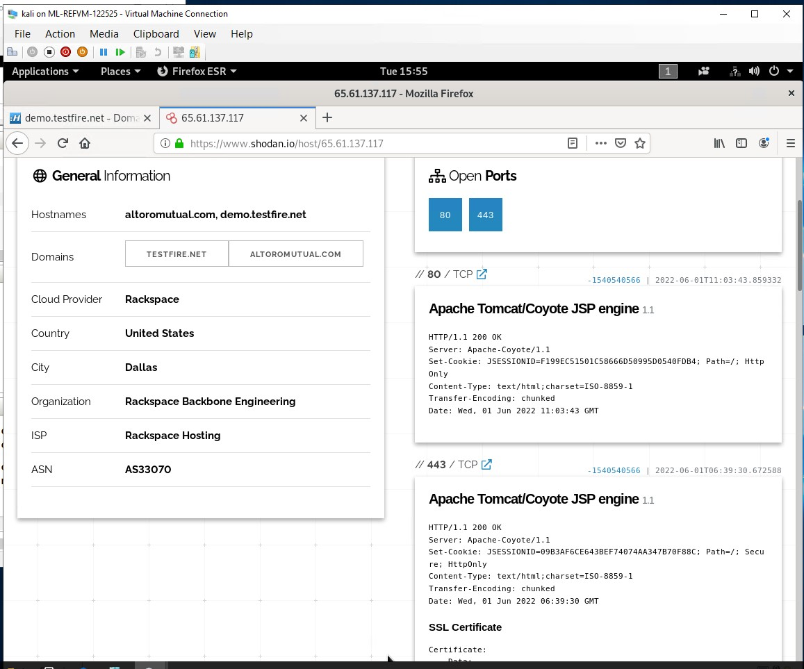

## Week 16 Homework Submission File: Penetration Testing 1

#### Step 1: Google Dorking

- Using Google, can you identify who the Chief Executive Officer of Altoro Mutual is:
  - From my findings using ` site: demo.testfire.net intext: executive` I found that `Karl Fitsgerald` is the CEO of Altoro Mutual

- How can this information be helpful to an attacker:
  - An attacker can use this information to social engineer attack a company or the CEO of the company

#### Step 2: DNS and Domain Discovery

Enter the IP address for `demo.testfire.net` into Domain Dossier and answer the following questions based on the results:

  1. Where is the company located: 
    `Sunnyvale, CA`
  2. What is the NetRange IP address:
    `65.61.137.64 - 65.661.137.127`
  3. What is the company they use to store their infrastructure:
    `Racespace Backbone Engineering`
  4. What is the IP address of the DNS server:
    `65.61.137.117`
#### Step 3: Shodan

- What open ports and running services did Shodan find:
  - `Port 80` Apache Tomcat/Coyote JSP Engine
  - `Port 443` Apahce Tomcat/Coyote JSP Engine
 
 
 
#### Step 4: Recon-ng

- Install the Recon module `xssed`. 
- Set the source to `demo.testfire.net`. 
- Run the module. 

Is Altoro Mutual vulnerable to XSS: Yes there is 1 vulnerability

### Step 5: Zenmap

Your client has asked that you help identify any vulnerabilities with their file-sharing server. Using the Metasploitable machine to act as your client's server, complete the following:

- Command for Zenmap to run a service scan against the Metasploitable machine: 
 - nmap -sV 192.168.0.10
- Bonus command to output results into a new text file named `zenmapscan.txt`:
  - `map -sV -oN zenmapscan.txt --script smb-enum-shares 192.168.0.10`
- Zenmap vulnerability script command: 
  - `nmap --script smb-enum-shares 192.168.0.10`
- Once you have identified this vulnerability, answer the following questions for your client:
  1. What is the vulnerability:
  - The vulnerability is anonymous users have read/write access to their SAMBA shares files.
  2. Why is it dangerous:
  - This is dangerous because it allows annoymous users to access to files and have the ability to change data in these files.
  3. What mitigation strategies can you recommendations for the client to protect their server:
  - You could disable the annoymous log access with the FTP server. 
---
© 2020 Trilogy Education Services, a 2U, Inc. brand. All Rights Reserved.  

